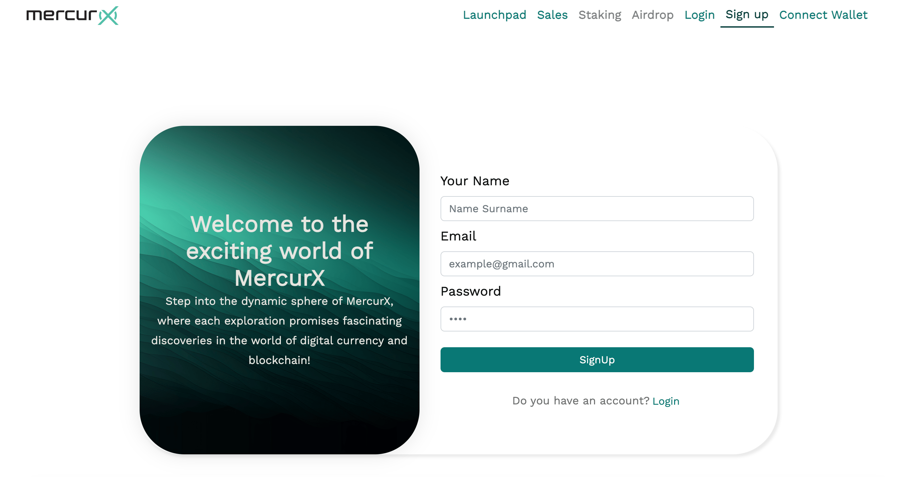
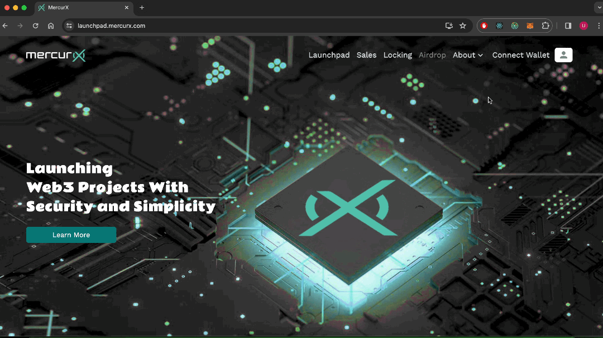
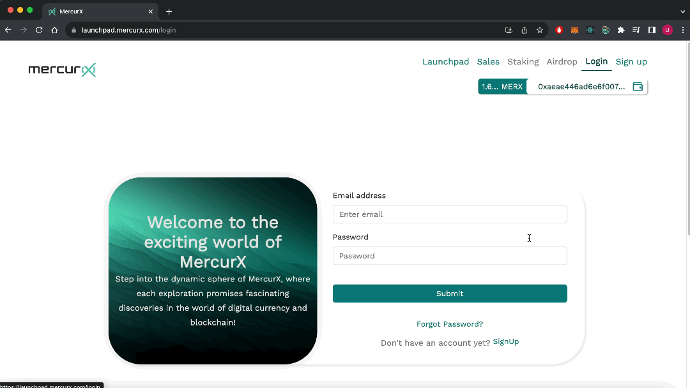

# 📄 Sign up & Login

## Signing up

Follow the steps below to sign up to Mercurx;

1. Go to the [Mercurx Website](https://launchpad.mercurx.com).
2. Click on the “Sign up” button on the top right of the screen.
3. Type your user name, email and password.
4. Click on “SingUp” button.

<figure><figcaption></figcaption></figure>

## Logging in

Follow the steps below to login to Mercurx;

1. Go to the [Mercurx Website](https://launchpad.mercurx.com).
2. Write your email and password.
3. Click on the "Submit" button.

<figure><figcaption></figcaption></figure>

## Logging out

Click on the profile symbol at the top right of the screen and then click on 'Logout'."

<figure><figcaption></figcaption></figure>

## Resetting your password

Follow the steps below to reset your password:

1. Click on “Forgot password” link on the login page.
2. Type your email and click “Send Password Reset Email”.&#x20;
3. Go to your email address and click on the "Reset Password" button in the email that has been sent to you.&#x20;
4. Enter your new password and click on the "Reset Password" button.

<figure><figcaption></figcaption></figure>
