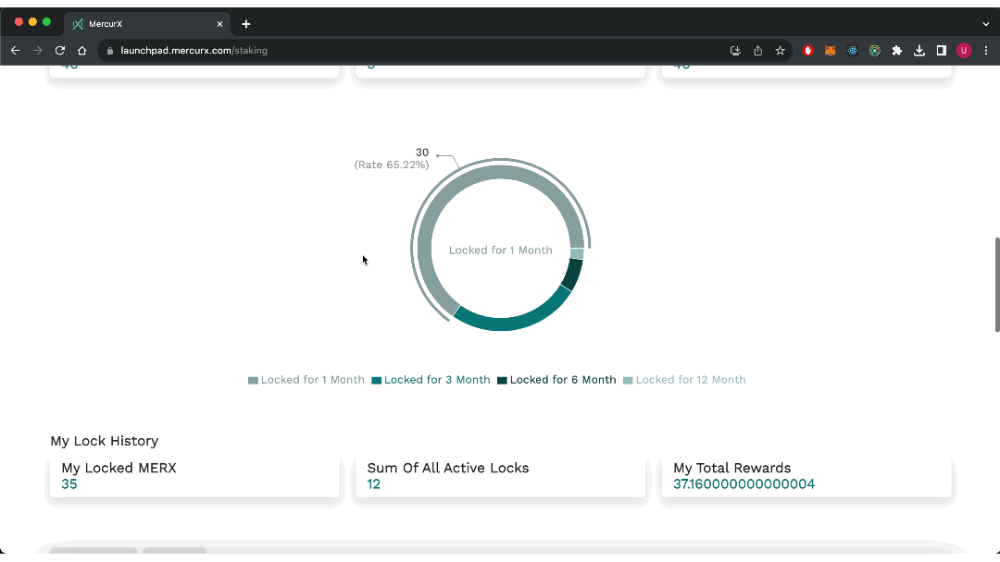

# 🔓 Lock Token

The following are available on [this screen](https://launchpad.mercurx.com/staking);

1. Choose how many months you want to lock, from the cards on the screen.
2. Enter how many merx you want to lock.
3. Click on the lock merx button.
4. Make the confirmation process from your wallet.

<figure><figcaption></figcaption></figure>

### The statistics of your transactions are shown in a pie-slice chart below:

<figure><figcaption></figcaption></figure>

At the bottom of the screen, all the transactions you have made are listed.

1. The claim button is active for locked transactions that have expired.&#x20;
2. Click on the claim button.
3. Make the confirmation from your wallet.
4. You can click on "Check detail transaction" for details.

<figure><figcaption></figcaption></figure>
