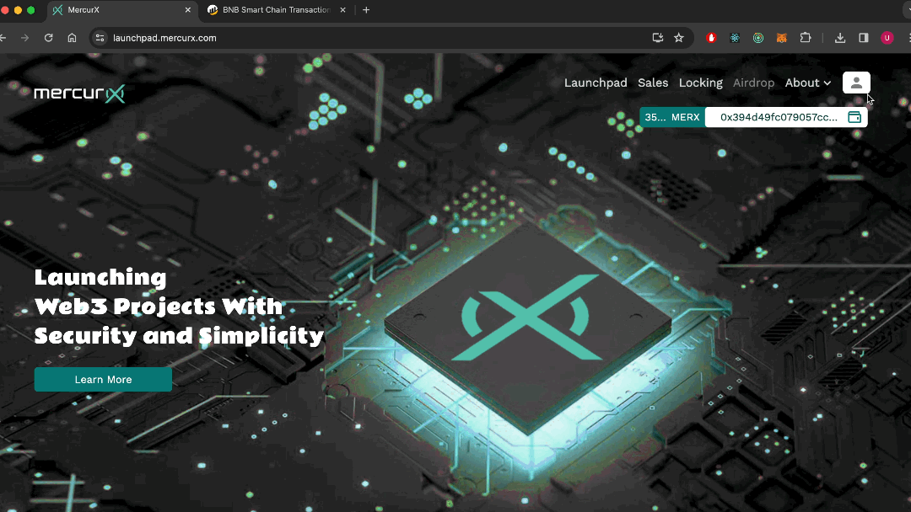

# 👨‍🏫 Profile

The following are available on [this screen](https://launchpad.mercurx.com/profile) ;

1. Email verification.
2. Kyc status.
3. Two Factor Authentication (2FA)
4. Wallet verification.
5. Tier

<figure><figcaption></figcaption></figure>

***

## Verify Email

You can view profile details, and if you are not verified, you can verify your email through the active button as well.

## Two Factor Authentication

You can enable two-factor authentication for added security to your account.

To enable this, follow these steps:

1. Download any two-factor authentication application to your phone.
2. Enter the secret key or scan the QR code from the opened window into the app you downloaded. This will generate codes for you at specific intervals.
3. Enter the received code and click the 'Finish' button.
4.  Complete the login process. (If you have enabled 2FA, you can perform actions by entering the code from the app you downloaded on your phone into the opened window.)

You can disable 2FA by following the same steps.

<figure><figcaption></figcaption></figure>

## Verify Wallet

You can see whether the wallet is connected or not.

## Tier

Your tier status is determined by the number of MERX in your possession, and as your tier status increases, you gain various advantages. \
The advantages are as follows:&#x20;

1. Tier-0 (<50 MERX) : Regular user, unable to access special events and airdrops.
2. Tier-1 (Between 50 - 1000 MERX) : Bronze user, first come, first buy.
3. Tier-2 (Between 1000 - 4000 MERX): Silver user, early access to special events.
4. Tier-3 (>4000 MERX) : Gold user, guarantee buying option for special events.
