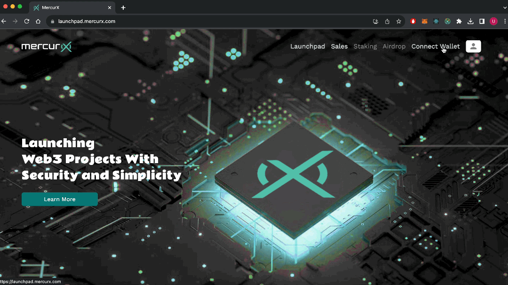
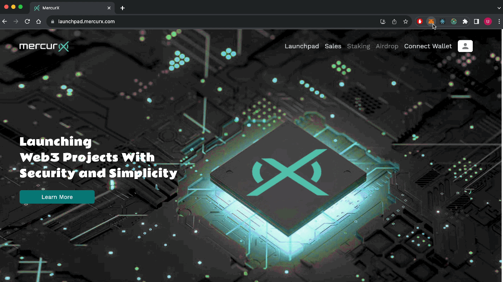
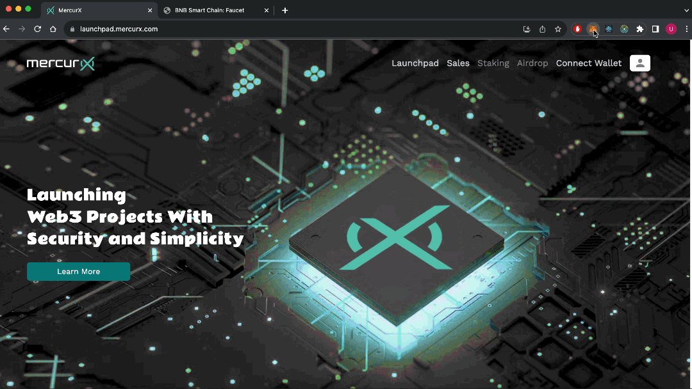
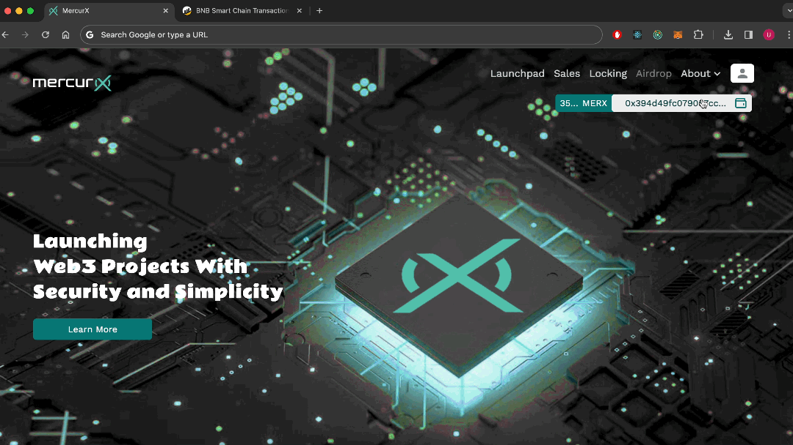

# 💰 Wallet

### **How to install MetaMask or Coinbase** 

You can find the latest information on how to install MetaMask and Coinbase on your browser right here.





## Connect Wallet

Follow the steps below to connect your wallet ;

1. Click on the "connect wallet" button at the top right of the screen.&#x20;
2. Select your wallet from the screen that opens.

### Connect Metamask

Metamask wallet must be attached to this section. MetaMask is a cryptocurrency wallet used to interact with the Ethereum blockchain.

<figure><figcaption></figcaption></figure>

### Connect Test Wallet

Install Metamask: If you don't have Metamask installed, you can download and install it as a browser extension for Chrome, Firefox, or Brave.

Set Up Metamask: Follow the setup process to create a new wallet or import an existing one.

Add Binance Smart Chain Network: Once Metamask is set up, you can add the Binance Smart Chain as a custom network by following these steps:

a. Click on the Metamask extension in your browser to open the Metamask interface.

b. Click on the network name at the top (it will likely say "Ethereum Mainnet" or another network if you've used Metamask before).

c. Scroll down to the bottom and select "Custom RPC."

d. In the "New Network" settings, enter the following information for the Binance Smart Chain:

Network Name: Binance Smart Chain Testnet \
New RPC URL: https://data-seed-prebsc-2-s3.binance.org:8545 \
ChainID: 97 \
Symbol: tBNB \
e. Click "Save" to add the Binance Smart Chain to your Metamask.

<figure><figcaption></figcaption></figure>

Switch to Binance Smart Chain Network: After adding the Binance Smart Chain network, you can switch to it by selecting "Binance Smart Chain" from the network list in Metamask.

Add tBNB Token: It's not automatically added to your Metamask token list. To add tBNB manually, follow these steps:

a. Click on the Metamask extension in your browser to open the Metamask interface.

b. Copy on "Chain address" at the top of the Metamask interface.

c. Open "[https://testnet.bnbchain.org/faucet-smart](https://testnet.bnbchain.org/faucet-smart)".

d. Paste the "Your Chain address".

e. Click on "Give me BNB"

<figure><figcaption></figcaption></figure>

### Wallet History

You can view your wallet history and all transactions from here.

<figure><figcaption></figcaption></figure>
